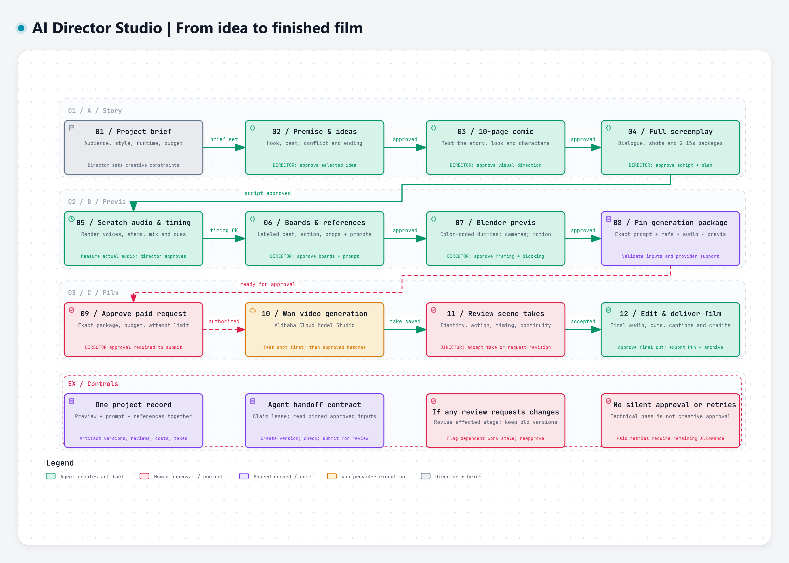

# AI Approval Workflow Dash

Director Studio is a local AI video-production dashboard with versioned artifacts, prompts beside previews, human approval gates, scene direction, scratch audio, a rough-cut timeline, and a reusable CLI/MCP agent interface.

The workflow connects premise, a 10-page comic, screenplay, measured temporary audio, storyboards, Blender previews, Wan generation packages, take review, and final editing. Each creative handoff preserves exact versions and waits for the director's approval.



[Full-resolution workflow PNG](docs/design/director-studio-workflow.png) · [Editable diagram JSON](docs/design/director-studio-workflow.json) · [Diagram notes and implementation status](docs/design/WORKFLOW_DIAGRAM.md)

## Open the studio

Clone the repository on Windows, then start the local app:

```powershell
git clone https://github.com/Perfectz/ai-approval-workflow-dash.git
cd ai-approval-workflow-dash
.\START_STUDIO.ps1
```

Open [Director Studio](http://127.0.0.1:8767/). The launcher installs dependencies on first use if needed and starts a hidden local server. Use `-Foreground` for a visible terminal process or `-Rebuild` after frontend changes. `OPEN_STUDIO.html` is a shortcut once the server is running.

The **Temporary audio lab** imports the technical timing test if it has been generated before the studio's first launch. On a fresh clone, run `python scripts/scratch_audio.py examples/timing-demo.json` first to populate it, or create scratch audio later from the dashboard. **My first film** is an empty starting project. Create more projects with the New project button. Nothing in the sample lab is an approved movie. Generated audio and personal project records stay local and are excluded from Git.

### What works

- Project creation, direction, scene packages, uploads and media previews.
- Prompt/reference editing, version history, prior-version comparison, file hashes and source pins.
- Exact-version approvals, requested changes, timecoded/page feedback and stale dependency tracking.
- Local scratch dialogue generation, isolated stems, measured waveform/cues and review jobs.
- Take selection, in/out ranges, ordered browser rough-cut playback, JSON and full project ZIP exports.
- Fourteen shared CLI/MCP tools for different agents, with task claims and gated handoffs.

### Production connections

The studio currently **prepares Wan request packages** and **accepts Blender previews and `.blend` files**. It does not yet upload references, send paid Wan requests, animate Blender scenes automatically, or render a mastered final cut. Agents use their available creation tools, then register results here. No API credentials or paid generation were used for this build.

Read the [workflow specification](docs/WORKFLOW_SPEC.md), [agent interface and MCP configuration](docs/AGENT_INTERFACE.md), and [reusable agent skill](.agents/skills/director-studio/SKILL.md). [Validation](docs/VALIDATION.md) records the checked behavior and remaining limits.

### Development and storage

Python 3.11+; Node.js 20.19+ or 22+; Windows speech voices for scratch synthesis. `ffprobe` is used to measure imported videos and compressed audio. Package files are locked in `requirements-lock.txt` and `package-lock.json`.

```powershell
.venv\Scripts\python.exe -m uvicorn studio.app:app --host 127.0.0.1 --port 8767
npm run dev
npm run build
.venv\Scripts\python.exe -m unittest discover -s tests -v
.venv\Scripts\python.exe -m studio.cli list_projects
```

For frontend development, the Vite server on port 5178 proxies `/api` to 8767. The built app is served directly on 8767. Runtime records and immutable files live in `studio-data/`; set `DIRECTOR_DATA` consistently for an alternate location. Stop all studio clients before copying the whole directory as a backup. This is a single-user local app, not a public multi-user deployment.

## Original standalone audio tool

Video target: **Wan 3.0 through Alibaba Cloud Model Studio**. Default generation package: **15 seconds, 30 fps**. Longer story scenes comprise multiple packages.

The standalone temporary dialogue tool remains available. It produces real WAV audio, measured cues, character stems, a browser review page, subtitles, a Blender timing manifest, and local Wan reference audio. No credentials, uploads, or video generation are involved.

## Try the timing demo

From this directory in PowerShell:

```powershell
python scripts/scratch_audio.py examples/timing-demo.json
```

Open `review.html` in the new output directory reported by the command. Alternatively, open `OPEN_TIMING_DEMO.html` after the included demo has been generated. Each run creates a new version under `outputs/TIMING_DEMO/`; previous versions are preserved.

The demo contains generic technical dialogue, not an approved movie premise, script or voice casting.

For an in-browser localhost preview with reliable audio seeking:

```powershell
python scripts/serve_review.py
```

Then open <http://127.0.0.1:8766/OPEN_TIMING_DEMO.html>. The server listens on this computer only and supports the byte-range requests used by media players.

## Write a timing draft

Copy `examples/timing-demo.json` into a new sequence file. Keep stable IDs for characters, lines, shots and jobs. Set each line's `start`, `slot_end`, `character` and `text`. Add silent action beats and camera descriptions. The `jobs` list describes generation boundaries. Use a 15-second sequence and one job as the default.

Set a locally installed voice per character. Current tested choices are `Microsoft David Desktop` and `Microsoft Zira Desktop`. These are deliberately temporary voices. `rate` defaults to zero; do not speed up dialogue merely to force it into a slot. Rewrite or reschedule first.

For an existing recording or a different TTS engine, add `audio_file` to a dialogue line. Paths resolve relative to the sequence JSON. Files must be 48 kHz, mono, 16-bit PCM WAV. The text field remains the intended transcript; the tool does not transcribe supplied audio or verify that it matches the text.

```powershell
ffmpeg -i recording.wav -ar 48000 -ac 1 -c:a pcm_s16le recording-48k.wav
```

The tool measures synthesized/recorded duration, preserves each whole line, adds silence on the timeline, and mixes without clipping. It flags overruns, unintended overlaps and lines crossing a generation boundary. Failed timing returns exit code 2 and keeps a full review mix; API reference slices are withheld. Invalid inputs or synthesis failures return 1. Passing timing returns 0, and is **not** user approval.

## Output files

| File | Purpose |
| --- | --- |
| `review.html` | Listen, seek by line or shot, and review pauses. |
| `mix.wav` | Complete temporary soundtrack, including deliberate silence. |
| `lines/*.wav` | Individual dialogue takes. |
| `stems/CHAR_*.wav` | Separate full-length character tracks. |
| `jobs/JOB_*.wav` | Timing-aligned reference audio per passing generation job. |
| `cue-sheet.csv`, `dialogue.srt` | Measured dialogue intervals. These are line-level, not word alignment. |
| `timing.json`, `source.json` | Build evidence and exact source snapshot. |
| `blender-timing.json` | 30 fps frame positions, sound file, shots and markers for the future Blender stage. |
| `wan-plan.json` | Local package plan; has no remote URLs or submission capability. |

Use [WORKFLOW.md](WORKFLOW.md) for the creative review stages and [docs/WAN_AND_AUDIO.md](docs/WAN_AND_AUDIO.md) for provider constraints and handoff details.

## Verification

```powershell
python -m unittest discover -s tests -v
python scripts/verify_audio.py outputs/TIMING_DEMO/<version>
```

The audio verifier checks durations, PCM format, character isolation, stem-to-mix agreement, package samples and clipping. Human listening remains required for pronunciation, performance and creative pacing.

No video API integration or Blender scene generation is implemented yet. Those depend on later creative approvals.

## License

MIT — see [LICENSE](LICENSE). You can use, modify and share the dashboard and workflow. [Archify](https://github.com/tt-a1i/archify) was used to create the included workflow diagram and is installed separately when regenerating it.
