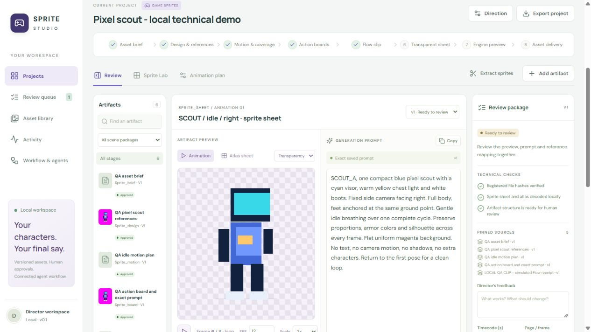

# Validation — Director Studio

## Sprite mode v0.2 — 29 September 2026

- Production build passes. All **47 Python tests pass** with isolated temporary data and no sample seeding. The real stdio MCP test lists **18 tools**, completes an agent handoff and preserves the human review gate.
- New cases cover workflow isolation, Omni duration choices, project cell defaults, pinned image integrity, stale animation plans, explicit upload/credit allowances, uncertain-result retry blocking, interrupted-attempt reconciliation, concurrent local extraction jobs, transparent packing and portable atlas paths.
- A complete temporary fixture goes from an approved local source clip through shared sprite extraction to a draft atlas and ZIP export. The original clip is preserved; all sheet/frame paths in the exported atlas resolve. Invalid external atlas content fails validation.
- Browser QA uses `outputs/sprite-dashboard-qa/data` on port 8770. It creates a sprite project with Unity and 64px cells, checks inherited animation defaults, and displays a separate locally drawn technical scout fixture. No Google upload, Generate click, provider API call or user film approval occurred.
- The browser displays sprite animation, transparent atlas, frame scrub, FPS/scale controls, exact prompts, pinned reference links, local QC, source clip and review status. The processed sheet remains awaiting human review.
- Desktop, 390px phone and 768px tablet layouts fit the viewport; the atlas decodes at 512 × 256 and the preview preserves its square proportions. Browser console reports no errors. Viewport overrides are reset after testing.
- `flow-sprite-studio` passes the skill creator's structural validator. Its provider instructions cite official Google documentation and require checking actual live account controls before execution.

These checks establish the local workflow, dashboard and processor. They do not establish a successful Google Flow generation, a production-quality AI sprite, or an import into Godot, Unity or Phaser. The actor shown in the preview is a locally drawn technical test fixture. A chosen engine is a target until the separate engine-preview stage is tested there.

## Original film mode v0.1

Checked locally on Windows, 26 September 2026.

Publication verification on 29 September 2026: `npm run build` passed, and all 26 Python tests passed again with `DIRECTOR_DATA` pointing to a temporary directory and `DIRECTOR_NO_SEED=1`. Personal project records and generated media were excluded from the Git publication. The workflow PNG and editable diagram source were added to `docs/design/`.

## Automated checks

- `npm run build`: passed TypeScript compilation and Vite production build.
- `python -m unittest discover -s tests -v`: **26 tests passed**.
- Real MCP stdio client initialized the server, listed 14 tools, claimed a task, registered a premise, submitted it, finished the task, and confirmed that it remained awaiting human review. No approve tool was exposed.
- Core cases covered: concurrent claims, expired leases, creative-context changes, stage bypass attempts, conflicting version edits, timeline conflicts, cross-project source isolation, transitive stale dependencies, immutable source copies, file-hash corruption, upload duration inspection, range playback, timeline bounds, exact prompt/review exports, comic page requirements and Wan reference duration/order rules.
- Scratch audio cases covered: preserved overruns, unintended versus explicit overlap, boundary-crossing speech, isolated stems, saved versions and safe review-page text.
- `skill-creator/scripts/quick_validate.py .agents/skills/director-studio`: passed using the system Python with PyYAML.
- npm dependency audit reported zero vulnerabilities at install time. This is a point-in-time dependency check, not a security audit.

## Browser verification

Used separate QA records under `outputs/studio-browser-qa`, served temporarily on port 8768. User-facing projects on port 8767 were left unapproved.

- Created a new test project with a brief; saved a readable premise and its exact prompt.
- Approved the test-only premise with an explicit QA note; the next-action panel advanced to **Comic**.
- Edited the audio lab prompt into v2; v1 remained available with its original prompt and review state.
- Compared v1/v2 and saved feedback anchored at 6 seconds; it remained attached to v2.
- Ran scratch audio from the dialog with fresh dialogue. The background job completed and produced a new 15-second artifact in the review queue, with separate voice tracks and timing data.
- Added two playable ranges to the rough cut, saved them, and played the sequence. The player reached the second range's out point and paused with no media error. Browser hard-cut timing is approximate; this is not a mastered render.
- Imported the existing dashboard wireframe through the file chooser. The image preview decoded at its original 1586 × 992 size, with a source-file download and prompt panel alongside it.
- Verified scene direction content and workflow documentation in the app.
- Checked the desktop layout and 390px/768px viewport overrides. Document width stayed within the viewport; artifact/stage rails scroll internally on narrow screens. Reset the viewport afterwards. No browser console errors were reported during the QA flow.
- Restarted the user-facing app through `START_STUDIO.ps1`; the launcher reported the local service ready at port 8767, and the dashboard loaded the persisted technical lab.

## Precise limits

The checks establish a working local coordination and review tool. They do not establish:

- a human judgment that the sample audio performance or film story is good;
- automatic Blender scene creation, dummy animation or renderer execution;
- successful Alibaba authentication, reference hosting, paid Wan submission, or a generated Wan take;
- a seamless final video render, final audio mix or lip-sync result;
- multi-user authorization, public deployment, or an import/restore UI.

Those integrations and their contracts are described in `WORKFLOW_SPEC.md`. The current Wan operation exports a request package and provenance only. It does not make a network submission or spend credits.
